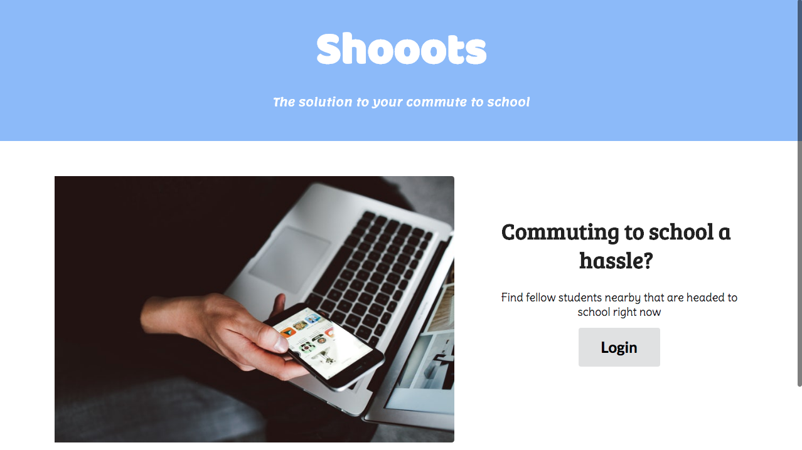
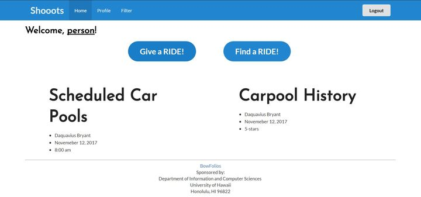
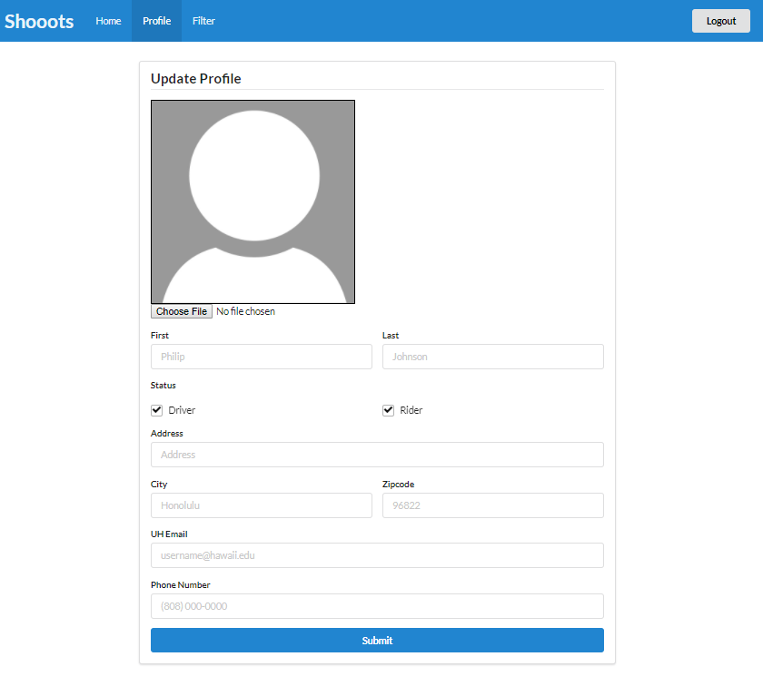
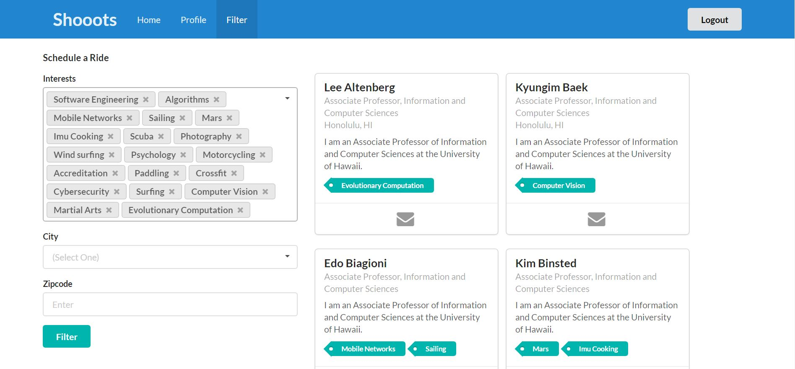
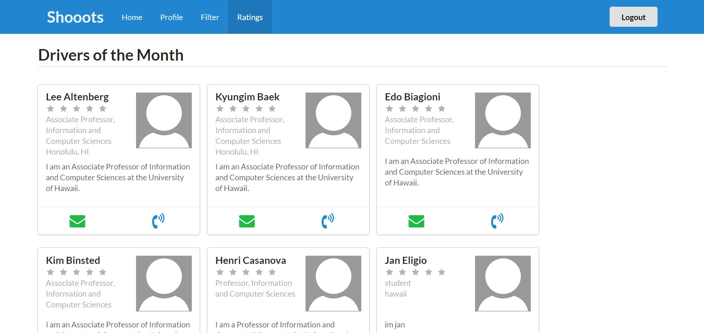

# Table of contents

* [About Shooots](#about-shooots)
* [Application design](#application-design)

* [Development history](#development-history)
  * [Milestone 1: Mockup development](#milestone-1-mockup-development)
  * [Milestone 2: Data model development](#milestone-2-data-model-development)
  * [Milestone 3: Connect UI to data model](#milestone-3-connect-ui-to-data-model)
  * [Milestone 4: Authentication](#milestone-4-authentication)
  * [Milestone 5: Administration](#milestone-5-administration)
* [Walkthrough videos](#walkthrough-videos)
* [JSDocs](/jsdocs)

# About Shooots 

# Application Design

## Milestone 1: Mockup development

This milestone started on December 6, 2016 and ended on January 31, 2017.

The goal of Milestone 1 was to create a set of HTML pages providing a mockup of the pages in the system. To simplify things, the mockup was developed as a Meteor app. This meant that each page was a template and that FlowRouter was used to implement routing to the pages. 

Mockups for the following four pages were implemented during M1:

Milestone 1 was implemented as [BowFolio GitHub Milestone M1](https://github.com/bowfolios/bowfolios/milestone/1)::

Milestone 1 consisted of five issues, and progress was managed via the [BowFolio GitHub Project M1](https://github.com/bowfolios/bowfolios/projects/1):

Each issue was implemented in its own branch, and merged into master when completed:

## Milestone 2: Data model development 

This milestone started on Jan 31, 2017 and ended on Feb 2, 2017.

The goal of Milestone 2 was to implement the data model: the underlying set of Mongo Collections and the operations upon them that would support the BowFolio application.  We implemented the data model as a set of Javascript classes. The BaseCollection class provides common fields and operations. The ProfileCollection and InterestCollection classes inherit from BaseCollection and provide the persistent data structures useful for BowFolios. 
 
Also in this milestone, we implemented a set of mocha tests for the data model classes. These tests make sure we can create, manipulate, and delete the data model documents successfully.  These tests are documented above.

Milestone 2 was implemented as [BowFolio GitHub Milestone M2](https://github.com/bowfolios/bowfolios/milestone/2)::

Milestone 2 consisted of two issues, and progress was managed via the [BowFolio GitHub Project M2](https://github.com/bowfolios/bowfolios/projects/2):

Each issue was implemented in its own branch, and merged into master when completed:

