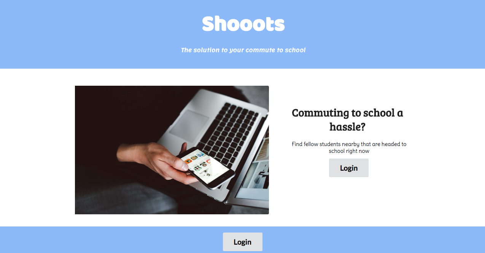
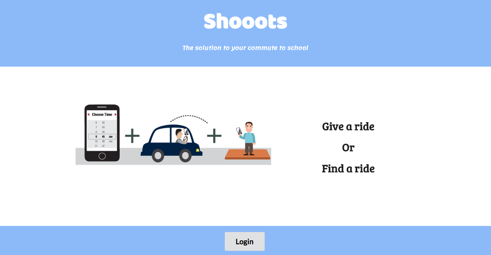
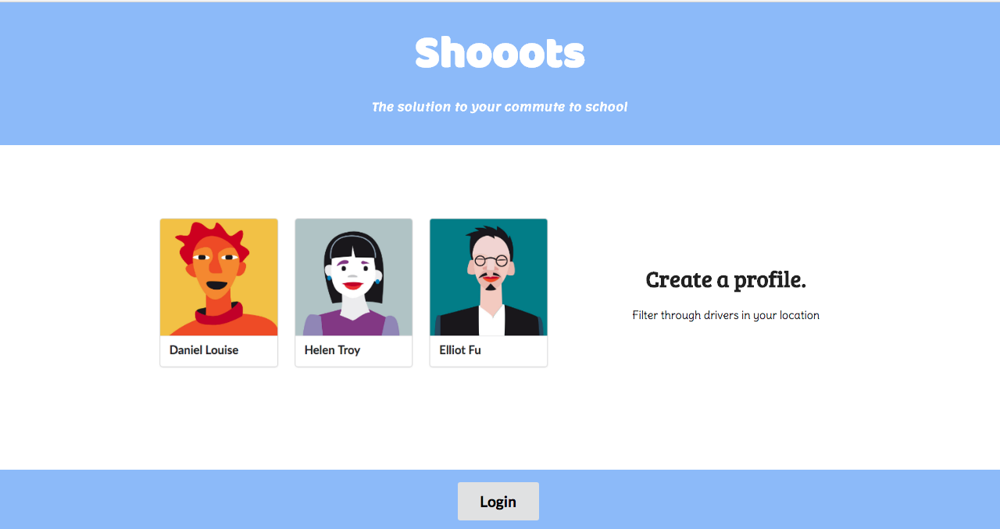
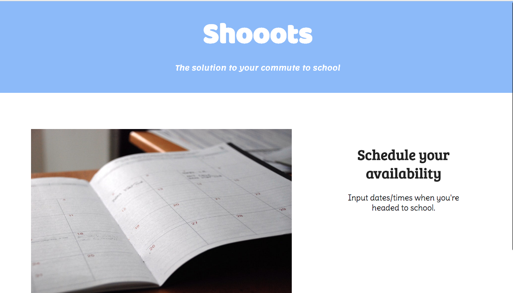
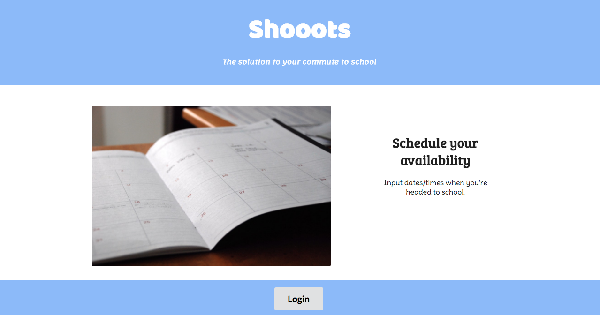
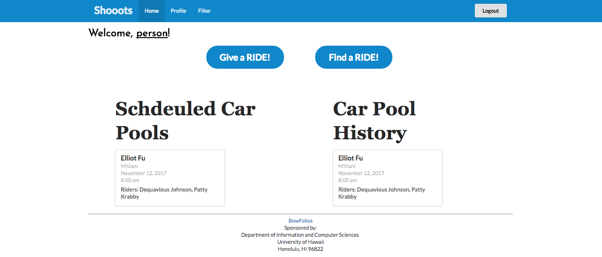
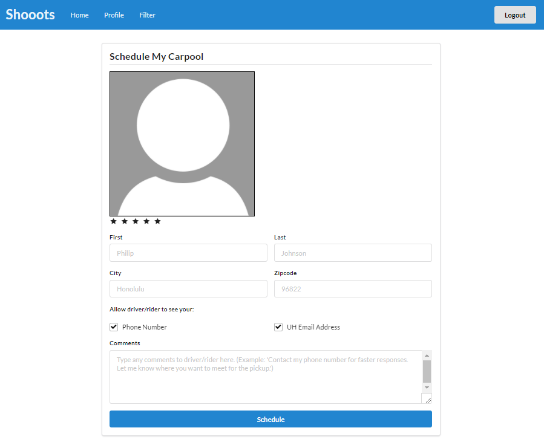

# Table of contents

* [About Shooots](#about-shooots)
* [Application design](#application-design)
* [Development history](#development-history)
  * [Milestone 1: Mockup development](#milestone-1-mockup-development)
  

# About Shooots 

Struggling with finding a ride to school? Tired of riding the bus to school? Well the solution is here, the **_shooots_** app. An app dedicated to making commuting to school for students easier and faster. Create a profile and filter through fellow students that are nearby, either needing a ride or willing to give a ride. As a driver or rider, schedule your availability and you are on your way to a better commuting experience. The ratings system is provided for both drivers and riders so that you know which driver/rider is the best for you and the best overall each month.

# Application Design

### Directory structure

The top-level directory contains:
```
app/                         # Holds the Meteor application sources
config/                      # Holds configuration files (i.e. settings.development.json)
.gitignore                   # Describes files to not commit (i.e. IntelliJ project files, node_modules, and settings.production.json)
```

The app/ directory's top-level directory structure contains:
```
client/
     lib/                    # Holds Semantic UI files
     head.html               # 
     main.js                 # Import all the client-side html and js files
imports/
     api/                    # Define collection processing code (client + server side)
          base/
          interest/
          profile/
     startup/                # Define code to run when system starts up for client-only and server-only
          client/
          server/
     ui/
          components/        # Templates that appear inside a page template
          layouts/           # Layouts containing common elements to all pages (i.e. menubar and footer)
          pages/             # Pages are navigated to by FlowRouter routes
          stylesheets/       # CSS customizations, if any
node_modules/                # Managed by Meteor
private/
     database/               # Holds the JSON file used to initialize the database on startup and to deploy
public/
     images/                 # Holds static images
server/
     main.js                 # Imports all the server-side js files
```

# Development History

The development process for **_shooots_** used **Issue Driven Project Management** practices.

The following subsections detail the development history of **_shooots_**.

### Milestone 1: Mockup development

The goal of Milestone 1 was to create a set of HTML pages providing a mockup of the pages in the system. To simplify things, the mockup was developed as a Meteor app. This meant that each page was a template and that FlowRouter was used to implement routing to the pages. 

Mockups for the following four pages were implemented during M1:

 











Milestone 1 was implemented as [shooots GitHub Milestone M1](https://github.com/shooots/shooots/milestone/1)


Milestone 1 consisted of eight issues, and progress was managed via the [shooots GitHub Project M1](https://github.com/shooots/shooots/projects/1):


Each issue was implemented in its own branch, and merged into master when completed:


### Milestone 2


