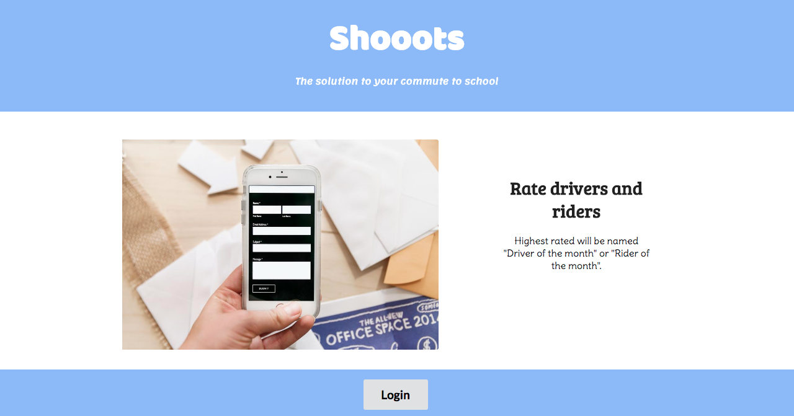
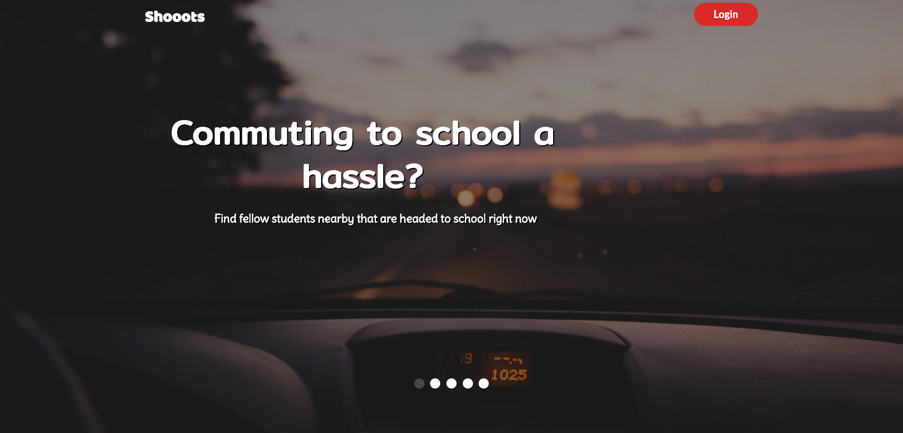
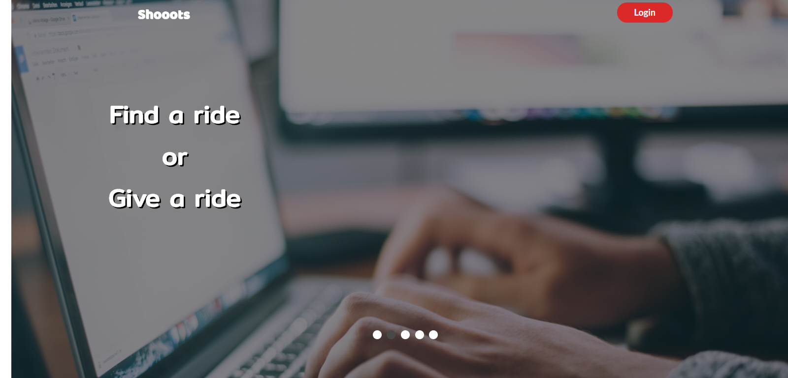
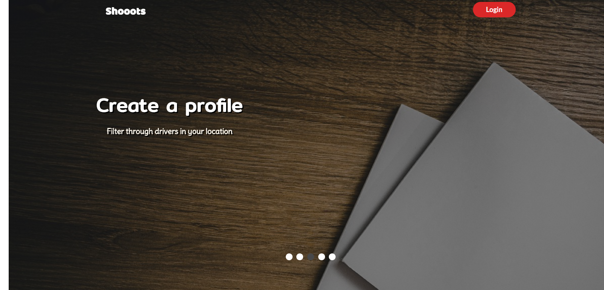
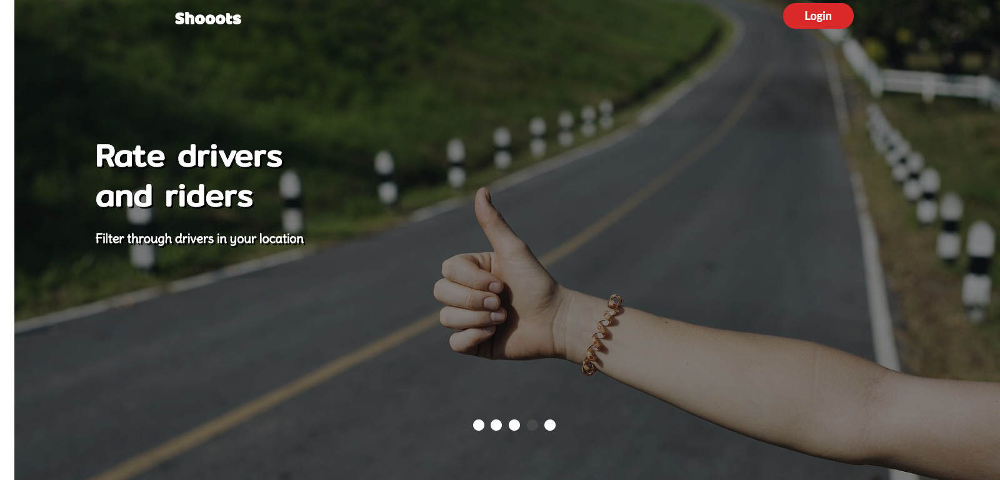
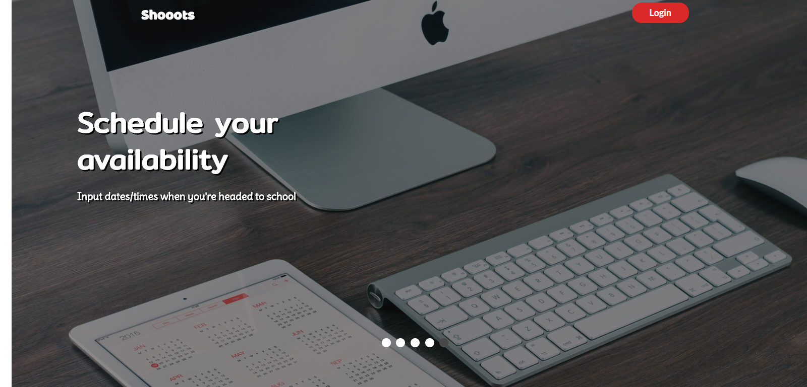
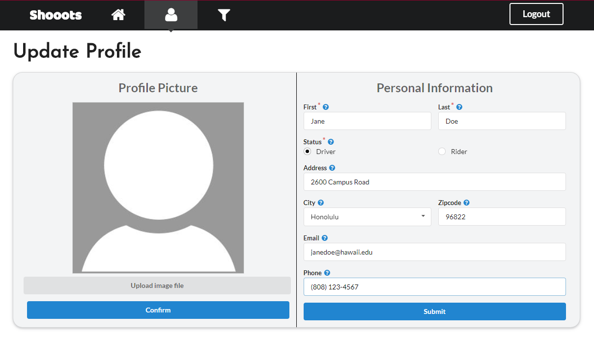
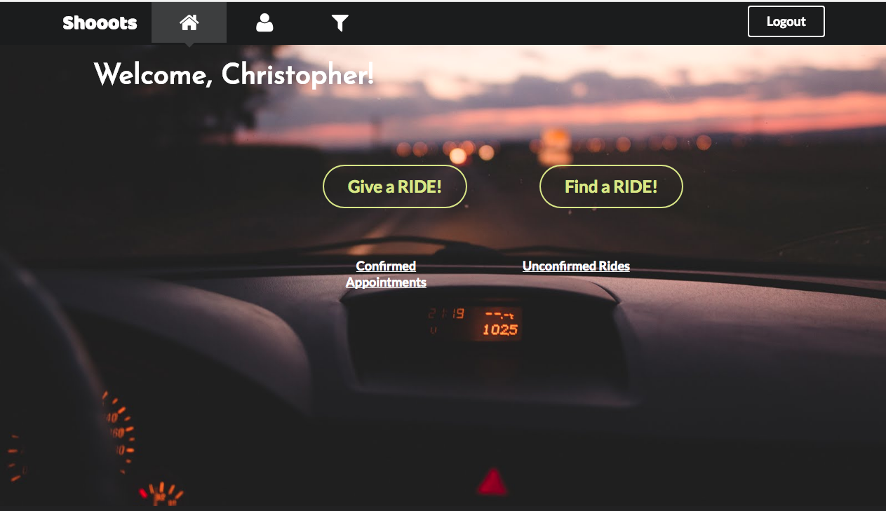
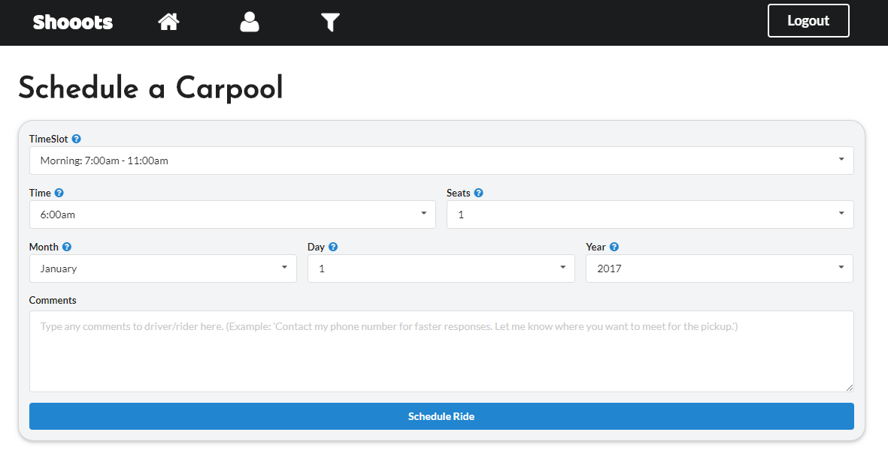

[shooots.meteorapp.com](https://shooots.meteorapp.com)
# Table of contents

* [About Shooots](#about-shooots)
* [Application design](#application-design)
* [Development history](#development-history)
  * [Milestone 1: Mockup development](#milestone-1-mockup-development)
  * [Milestone 2: Functionality](#milestone-2-functionality)
  * [FeedBack](#FeedBack)


  

# About Shooots 

Struggling with finding a ride to school? Tired of riding the bus to school? Well the solution is here, the **_shooots_** app. An app dedicated to making commuting to school for students easier and faster. Create a profile and filter through fellow students that are nearby, either needing a ride or willing to give a ride. As a driver or rider, schedule your availability and you are on your way to a better commuting experience. The ratings system is provided for both drivers and riders so that you know which driver/rider is the best for you and the best overall each month.

# Application Design

### Directory structure

The top-level directory contains:
```
app/                         # Holds the Meteor application sources
config/                      # Holds configuration files (i.e. settings.development.json)
.gitignore                   # Describes files to not commit (i.e. IntelliJ project files, node_modules, and settings.production.json)
```

The app/ directory's top-level directory structure contains:
```
client/
     lib/                    # Holds Semantic UI files
     head.html               # 
     main.js                 # Import all the client-side html and js files
imports/
     api/                    # Define collection processing code (client + server side)
          base/
          interest/
          profile/
     startup/                # Define code to run when system starts up for client-only and server-only
          client/
          server/
     ui/
          components/        # Templates that appear inside a page template
          layouts/           # Layouts containing common elements to all pages (i.e. menubar and footer)
          pages/             # Pages are navigated to by FlowRouter routes
          stylesheets/       # CSS customizations, if any
node_modules/                # Managed by Meteor
private/
     database/               # Holds the JSON file used to initialize the database on startup and to deploy
public/
     images/                 # Holds static images
server/
     main.js                 # Imports all the server-side js files
```

# Development History

The development process for **_shooots_** used **Issue Driven Project Management** practices.

The following subsections detail the development history of **_shooots_**.

### Milestone 1: Mockup development

The goal of Milestone 1 was to create a set of HTML pages providing a mockup of the pages in the system. To simplify things, the mockup was developed as a Meteor app. This meant that each page was a template and that FlowRouter was used to implement routing to the pages. 

Mockups for the following four pages were implemented during M1:

 





Milestone 1 was implemented as [shooots GitHub Milestone M1](https://github.com/shooots/shooots/milestone/1)


Milestone 1 consisted of eight issues, and progress was managed via the [shooots GitHub Project M1](https://github.com/shooots/shooots/projects/1):


Each issue was implemented in its own branch, and merged into master when completed:


### Milestone 2: Functionality

The goal of Milestone 2 was to have a fully functional application. Users are now able to update their profile when deciding whether to be a driver or a rider. As a rider, users may now filter through drivers that are avaliable, by filtering to a  spectifc time. Once the rider clicks "schedule" on their preferred driver, a notification is then sent to the driver. A notification on the riders home page will show whether or not the driver has confirmed the appointment.  

As a driver, users are able to schedule their date, location, and time that they are headed to school. Once they list their information, their profile is now shown on the filter page. If a rider schedules the user as their designated driver, the user will get a pop up notfication on whether to accept the appointmet or not.

 Once the driver accepts the appointment, a scheduled appointement card will show up on the driver's/rider's homepage, reminding them about the appointment. 


 












### FeedBack

J.H
 - I like how simple it is
 - If this was a mobile app, it is something I would use
 - Scheduling a ride was easy to do
 - It looks like a real working website from a company
 
C.B
 - "This will be very useful for people that live on the other side of the island."
 - "I like the notification options on the home page."
 - "I like the pictures on the landing page."
 
M.C
 - "Wow, this is perfect for people that hate taking the bus to school."
 - "I will totally use this."
 - "I wonder if it'll be hard to get drivers on the platform."
 
J.C
 - "Cool, but I probably won't use it, I don't live too far."
 - "The black and white color scheme is kind of boring, just a little bit."
 - "Do riders have to give gas money?."
 
L.W.
 - "This could totally be useful right now!."
 - "Perfect, now I don't have to wait for the bus."
 - "Kind of sketchy riding with strangers."
